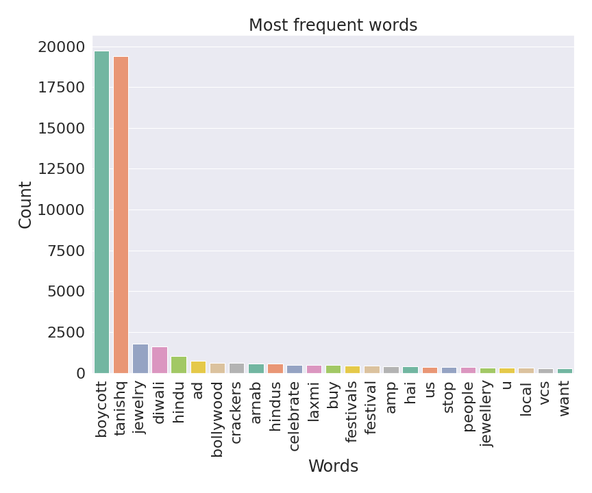
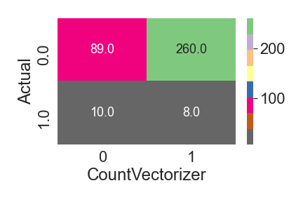
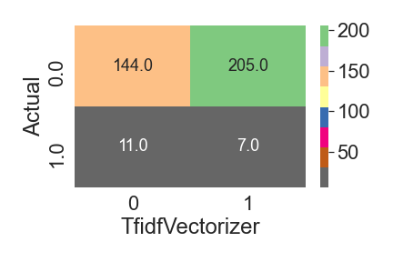
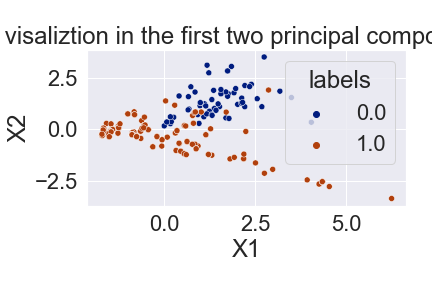

# Tanishq Controversial Ad Sentiment Classification

#### Second Capstone Project For Springboard using neural networks to generate images

> A repo for sentiment analysis on Twitter data about the recent Tanishq controversial ad using Natural Language Processing

## Introduction

In this project, twitter data about the recent controversial Tanisq ad, which incited religious tension amongst Hindus, were scrapped and a machine learning model is generated based on Natural Language Processing. This model can be used to identify public sentiment about the company that will help company better navigate their ad campaigns. 

Twitter data was collected using twitter API with tweepy python package.

Following libraries are used in this project:

<table>

<tr>
  <td><b>Task</b></td>
  <td><b>Python Packages</b></td>
  <td><b>Notebooks</b></td>
</tr>

<tr>
  <td>Data Collection</td>
  <td>tweepy</td>
  <td><a href="./notebooks/get_tweet.ipynb">get_tweet.ipynb</a></td>
</tr>

<tr>
  <td>Data Cleaning and Visualization</td>
  <td>seaborn, matplotlib, plotly, wordcloud, pandas, nltk</td>
  <td><a href="./notebooks/cleaning_viz.ipynb">cleaning_viz.ipynb</a></td>
</tr>

<tr>
  <td>Manual Labeling</td>
  <td>numpy, glob, json, pandas</td>
  <td><a href="./notebooks/labeling.ipynb">labeling.ipynb</a></td>
</tr>

<tr>
  <td>Pretrained model</td>
  <td>vader, textblob, flair</td>
  <td><a href="./notebooks/pretrained_sentiment_analysis.ipynb">pretrained_sentiment_analysis.ipynb</a></td>
</tr>

<tr>
  <td>Unsupervised Learning</td>
  <td>sklearn, xgboost, lightgbm, lazypredict</td>
  <td><a href="./notebooks/unsupervised_sentiment_analysis.ipynb">unsupervised_sentiment_analysis.ipynb</a></td>
</tr>

<tr>
  <td>Supervised Learning</td>
  <td>sklearn, xgboost, lightgbm, lazypredict</td>
  <td><a href="./notebooks/supervised_sentiment_analysis.ipynb">supervised_sentiment_analysis.ipynb</a></td>
</tr>

<tr>
  <td>Pseudolabeling</td>
  <td>snorkel, sklearn, xgboost, vader, textblob</td>
  <td><a href="./notebooks/pseudolabeling_2.ipynb">pseudolabeling_2.ipynb</a></td>
</tr>

<tr>
  <td>SMOTE</td>
  <td>imblearn</td>
  <td><a href="./notebooks/smote_2.ipynb">smote_2.ipynb</a></td>
</tr>

</table>

## Data Collection

Here, the data is collected using tweepy python package. In order to quickly fetch data using tweepy, a small python function is written [[fetch_tweets](./src/data/get_tweets.py)]. Access token and consumer token are stored in the .env file and accessed with dotenv python package to ensure data security (.env is not tracked with .git file). Sample usage of the `get_tweets` function is shown below:

```python
import pandas as pd
from src.data.get_tweets import fetch_tweets

df = pd.DataFrame(columns=['text', 'source', 'url'])
msgs = []
msg =[]

for tweet in tweepy.Cursor(api.search, q='#MSFT', rpp=100).items(10):
    msg = [tweet.text, tweet.source, tweet.source_url] 
    msg = tuple(msg)                    
    msgs.append(msg)

df = pd.DataFrame(msgs)
```

## Data Cleaning and Visualization

Following steps were taken to clean the data:

1. Hashtags (`#`), URL, emoji, mentions, and numbers were removed using tweet preprocessing python package.
2. All the texts were converted to lowercase and any special characters were removed. 
3. `WordNetLemmatizer` and `TweetTokenizer` from `nltk` package were used to lemmatize and tokenize the sentences. 

Then a wordcloud is formed:


A barchart is drawn to illustrate the relative frequency of each word:



Here, it's clear that `boycott` and `tanishq` are the two most frequent words in this particular twitter corpus.

Next, I plot the bigram frequency as bigram oftentimes are very important in natural language processing:


As expected, `boycott tanishq` and `tanishq boycott` are the two most frequent bigram.

## Manual labeling

Here, I manually lablled a few data to develop machine learning model. I used python's native functionality to label the data but nowadays sophisticated GUI package available to label the data.

## Pretrained model

Next, I analyzed the performance of three pretrained sentiment analysis models, namely: 1. vader, 2. textblob, and 3. flair, with the labelled data as benchmark. Below I show the confusion matrix of three models:

**Vader Sentiment Analyzer**


**Textblob Sentiment Analyzer**


**Flair Sentiment Analyzer**


## Unsupervised sentiment analysis

Confusion matrix for Kmeans clustering algorithm with countvecorizer:


Confusion matrix for Kmeans clustering algorithm with tfidf vecorizer:


So far, only the textblob were able to have high recall for positive sentiment. Next, I'll try to implement supervised learning to improve the positive sentiment recall.

## Supervised sentiment analysis

Next, I used `lazypredict` package to quickly scan the performance of most of the  `sklearn` classifiers with `xgboost` and `lightgbm` without any hyperparameter optimization. Below I show the perfomance of different classifiers with `countvectorizer`:

<table border="1" class="dataframe">
  <thead>
    <tr style="text-align: right;">
      <th><b>Model</b></th>
      <th>Accuracy</th>
      <th>Balanced Accuracy</th>
      <th>ROC AUC</th>
      <th>F1 Score</th>
      <th>Time Taken</th>
    </tr>
  </thead>
  <tbody>
    <tr>
      <th>LinearDiscriminantAnalysis</th>
      <td>0.88</td>
      <td>0.75</td>
      <td>0.75</td>
      <td>0.90</td>
      <td>0.13</td>
    </tr>
    <tr>
      <th>XGBClassifier</th>
      <td>0.95</td>
      <td>0.69</td>
      <td>0.69</td>
      <td>0.94</td>
      <td>0.26</td>
    </tr>
    <tr>
      <th>AdaBoostClassifier</th>
      <td>0.96</td>
      <td>0.60</td>
      <td>0.60</td>
      <td>0.94</td>
      <td>0.24</td>
    </tr>
    <tr>
      <th>DecisionTreeClassifier</th>
      <td>0.95</td>
      <td>0.59</td>
      <td>0.59</td>
      <td>0.93</td>
      <td>0.05</td>
    </tr>
    <tr>
      <th>ExtraTreeClassifier</th>
      <td>0.95</td>
      <td>0.59</td>
      <td>0.59</td>
      <td>0.93</td>
      <td>0.04</td>
    </tr>
    <tr>
      <th>DummyClassifier</th>
      <td>0.92</td>
      <td>0.58</td>
      <td>0.58</td>
      <td>0.92</td>
      <td>0.05</td>
    </tr>
    <tr>
      <th>QuadraticDiscriminantAnalysis</th>
      <td>0.12</td>
      <td>0.53</td>
      <td>0.53</td>
      <td>0.13</td>
      <td>0.09</td>
    </tr>
    <tr>
      <th>CalibratedClassifierCV</th>
      <td>0.95</td>
      <td>0.50</td>
      <td>0.50</td>
      <td>0.92</td>
      <td>2.65</td>
    </tr>
    <tr>
      <th>NearestCentroid</th>
      <td>0.95</td>
      <td>0.50</td>
      <td>0.50</td>
      <td>0.92</td>
      <td>0.04</td>
    </tr>
    <tr>
      <th>BernoulliNB</th>
      <td>0.95</td>
      <td>0.50</td>
      <td>0.50</td>
      <td>0.92</td>
      <td>0.05</td>
    </tr>
    <tr>
      <th>SVC</th>
      <td>0.95</td>
      <td>0.50</td>
      <td>0.50</td>
      <td>0.92</td>
      <td>0.20</td>
    </tr>
    <tr>
      <th>SGDClassifier</th>
      <td>0.95</td>
      <td>0.50</td>
      <td>0.50</td>
      <td>0.92</td>
      <td>0.06</td>
    </tr>
    <tr>
      <th>RidgeClassifierCV</th>
      <td>0.95</td>
      <td>0.50</td>
      <td>0.50</td>
      <td>0.92</td>
      <td>0.08</td>
    </tr>
    <tr>
      <th>RidgeClassifier</th>
      <td>0.95</td>
      <td>0.50</td>
      <td>0.50</td>
      <td>0.92</td>
      <td>0.05</td>
    </tr>
    <tr>
      <th>RandomForestClassifier</th>
      <td>0.95</td>
      <td>0.50</td>
      <td>0.50</td>
      <td>0.92</td>
      <td>0.17</td>
    </tr>
    <tr>
      <th>PassiveAggressiveClassifier</th>
      <td>0.95</td>
      <td>0.50</td>
      <td>0.50</td>
      <td>0.92</td>
      <td>0.07</td>
    </tr>
    <tr>
      <th>LogisticRegression</th>
      <td>0.95</td>
      <td>0.50</td>
      <td>0.50</td>
      <td>0.92</td>
      <td>0.06</td>
    </tr>
    <tr>
      <th>CheckingClassifier</th>
      <td>0.95</td>
      <td>0.50</td>
      <td>0.50</td>
      <td>0.92</td>
      <td>0.04</td>
    </tr>
    <tr>
      <th>LinearSVC</th>
      <td>0.95</td>
      <td>0.50</td>
      <td>0.50</td>
      <td>0.92</td>
      <td>0.71</td>
    </tr>
    <tr>
      <th>BaggingClassifier</th>
      <td>0.95</td>
      <td>0.50</td>
      <td>0.50</td>
      <td>0.92</td>
      <td>0.11</td>
    </tr>
    <tr>
      <th>LabelSpreading</th>
      <td>0.95</td>
      <td>0.50</td>
      <td>0.50</td>
      <td>0.92</td>
      <td>0.04</td>
    </tr>
    <tr>
      <th>LabelPropagation</th>
      <td>0.95</td>
      <td>0.50</td>
      <td>0.50</td>
      <td>0.92</td>
      <td>0.05</td>
    </tr>
    <tr>
      <th>KNeighborsClassifier</th>
      <td>0.95</td>
      <td>0.50</td>
      <td>0.50</td>
      <td>0.92</td>
      <td>0.11</td>
    </tr>
    <tr>
      <th>ExtraTreesClassifier</th>
      <td>0.95</td>
      <td>0.50</td>
      <td>0.50</td>
      <td>0.92</td>
      <td>0.17</td>
    </tr>
    <tr>
      <th>Perceptron</th>
      <td>0.93</td>
      <td>0.49</td>
      <td>0.49</td>
      <td>0.91</td>
      <td>0.04</td>
    </tr>
    <tr>
      <th>GaussianNB</th>
      <td>0.93</td>
      <td>0.49</td>
      <td>0.49</td>
      <td>0.91</td>
      <td>0.04</td>
    </tr>
    <tr>
      <th>LGBMClassifier</th>
      <td>0.92</td>
      <td>0.49</td>
      <td>0.49</td>
      <td>0.91</td>
      <td>0.09</td>
    </tr>
  </tbody>
</table>

With `tfidf vectorizer`:

<table border="1" class="dataframe">
  <thead>
    <tr style="text-align: right;">
      <th><b>Model</b></th>
      <th>Accuracy</th>
      <th>Balanced Accuracy</th>
      <th>ROC AUC</th>
      <th>F1 Score</th>
      <th>Time Taken</th>
    </tr>
  </thead>
  <tbody>
    <tr>
      <th>LGBMClassifier</th>
      <td>0.97</td>
      <td>0.70</td>
      <td>0.70</td>
      <td>0.96</td>
      <td>0.66</td>
    </tr>
    <tr>
      <th>XGBClassifier</th>
      <td>0.96</td>
      <td>0.69</td>
      <td>0.69</td>
      <td>0.95</td>
      <td>2.21</td>
    </tr>
    <tr>
      <th>DecisionTreeClassifier</th>
      <td>0.96</td>
      <td>0.60</td>
      <td>0.60</td>
      <td>0.94</td>
      <td>0.60</td>
    </tr>
    <tr>
      <th>AdaBoostClassifier</th>
      <td>0.96</td>
      <td>0.60</td>
      <td>0.60</td>
      <td>0.94</td>
      <td>2.93</td>
    </tr>
    <tr>
      <th>LinearDiscriminantAnalysis</th>
      <td>0.95</td>
      <td>0.59</td>
      <td>0.59</td>
      <td>0.93</td>
      <td>1.21</td>
    </tr>
    <tr>
      <th>DummyClassifier</th>
      <td>0.92</td>
      <td>0.58</td>
      <td>0.58</td>
      <td>0.92</td>
      <td>0.39</td>
    </tr>
    <tr>
      <th>QuadraticDiscriminantAnalysis</th>
      <td>0.10</td>
      <td>0.52</td>
      <td>0.52</td>
      <td>0.09</td>
      <td>0.96</td>
    </tr>
    <tr>
      <th>CalibratedClassifierCV</th>
      <td>0.95</td>
      <td>0.50</td>
      <td>0.50</td>
      <td>0.92</td>
      <td>29.55</td>
    </tr>
    <tr>
      <th>BernoulliNB</th>
      <td>0.95</td>
      <td>0.50</td>
      <td>0.50</td>
      <td>0.92</td>
      <td>0.43</td>
    </tr>
    <tr>
      <th>SVC</th>
      <td>0.95</td>
      <td>0.50</td>
      <td>0.50</td>
      <td>0.92</td>
      <td>2.08</td>
    </tr>
    <tr>
      <th>RidgeClassifierCV</th>
      <td>0.95</td>
      <td>0.50</td>
      <td>0.50</td>
      <td>0.92</td>
      <td>0.48</td>
    </tr>
    <tr>
      <th>RidgeClassifier</th>
      <td>0.95</td>
      <td>0.50</td>
      <td>0.50</td>
      <td>0.92</td>
      <td>0.46</td>
    </tr>
    <tr>
      <th>RandomForestClassifier</th>
      <td>0.95</td>
      <td>0.50</td>
      <td>0.50</td>
      <td>0.92</td>
      <td>0.67</td>
    </tr>
    <tr>
      <th>NearestCentroid</th>
      <td>0.95</td>
      <td>0.50</td>
      <td>0.50</td>
      <td>0.92</td>
      <td>0.40</td>
    </tr>
    <tr>
      <th>CheckingClassifier</th>
      <td>0.95</td>
      <td>0.50</td>
      <td>0.50</td>
      <td>0.92</td>
      <td>0.39</td>
    </tr>
    <tr>
      <th>BaggingClassifier</th>
      <td>0.95</td>
      <td>0.50</td>
      <td>0.50</td>
      <td>0.92</td>
      <td>0.95</td>
    </tr>
    <tr>
      <th>LabelSpreading</th>
      <td>0.95</td>
      <td>0.50</td>
      <td>0.50</td>
      <td>0.92</td>
      <td>0.40</td>
    </tr>
    <tr>
      <th>LabelPropagation</th>
      <td>0.95</td>
      <td>0.50</td>
      <td>0.50</td>
      <td>0.92</td>
      <td>0.40</td>
    </tr>
    <tr>
      <th>KNeighborsClassifier</th>
      <td>0.95</td>
      <td>0.50</td>
      <td>0.50</td>
      <td>0.92</td>
      <td>1.09</td>
    </tr>
    <tr>
      <th>GaussianNB</th>
      <td>0.95</td>
      <td>0.50</td>
      <td>0.50</td>
      <td>0.92</td>
      <td>0.45</td>
    </tr>
    <tr>
      <th>ExtraTreesClassifier</th>
      <td>0.95</td>
      <td>0.50</td>
      <td>0.50</td>
      <td>0.92</td>
      <td>0.92</td>
    </tr>
    <tr>
      <th>LogisticRegression</th>
      <td>0.95</td>
      <td>0.50</td>
      <td>0.50</td>
      <td>0.92</td>
      <td>0.74</td>
    </tr>
    <tr>
      <th>LinearSVC</th>
      <td>0.93</td>
      <td>0.49</td>
      <td>0.49</td>
      <td>0.91</td>
      <td>7.52</td>
    </tr>
    <tr>
      <th>PassiveAggressiveClassifier</th>
      <td>0.93</td>
      <td>0.49</td>
      <td>0.49</td>
      <td>0.91</td>
      <td>0.88</td>
    </tr>
    <tr>
      <th>SGDClassifier</th>
      <td>0.93</td>
      <td>0.49</td>
      <td>0.49</td>
      <td>0.91</td>
      <td>0.44</td>
    </tr>
    <tr>
      <th>ExtraTreeClassifier</th>
      <td>0.93</td>
      <td>0.49</td>
      <td>0.49</td>
      <td>0.91</td>
      <td>0.40</td>
    </tr>
    <tr>
      <th>Perceptron</th>
      <td>0.92</td>
      <td>0.49</td>
      <td>0.49</td>
      <td>0.91</td>
      <td>0.43</td>
    </tr>
  </tbody>
</table>

## Pseudolabeling

I used snokel weak supervision approach to train an intermediate generator model to label the unlabelled data and then trained a discriminator model to classify the tweets. The performance of the final discriminator model is summarized below:

<table border="1" class="dataframe">
  <thead>
    <tr style="text-align: right;">
      <th>Model</th>
      <th>Accuracy</th>
      <th>Balanced Accuracy</th>
      <th>ROC AUC</th>
      <th>F1 Score</th>
      <th>Time Taken</th>
    </tr>
  </thead>
  <tbody>
    <tr>
      <th>LGBMClassifier</th>
      <td>0.43</td>
      <td>0.61</td>
      <td>0.61</td>
      <td>0.56</td>
      <td>1.64</td>
    </tr>
    <tr>
      <th>XGBClassifier</th>
      <td>0.41</td>
      <td>0.60</td>
      <td>0.61</td>
      <td>0.53</td>
      <td>3.82</td>
    </tr>
    <tr>
      <th>ExtraTreesClassifier</th>
      <td>0.20</td>
      <td>0.57</td>
      <td>0.59</td>
      <td>0.25</td>
      <td>0.79</td>
    </tr>
    <tr>
      <th>RandomForestClassifier</th>
      <td>0.16</td>
      <td>0.56</td>
      <td>0.57</td>
      <td>0.20</td>
      <td>0.57</td>
    </tr>
    <tr>
      <th>DecisionTreeClassifier</th>
      <td>0.51</td>
      <td>0.55</td>
      <td>0.57</td>
      <td>0.63</td>
      <td>0.17</td>
    </tr>
    <tr>
      <th>DummyClassifier</th>
      <td>0.26</td>
      <td>0.51</td>
      <td>0.53</td>
      <td>0.36</td>
      <td>0.07</td>
    </tr>
    <tr>
      <th>ExtraTreeClassifier</th>
      <td>0.42</td>
      <td>0.51</td>
      <td>0.51</td>
      <td>0.55</td>
      <td>0.09</td>
    </tr>
    <tr>
      <th>CalibratedClassifierCV</th>
      <td>0.07</td>
      <td>0.51</td>
      <td>0.51</td>
      <td>0.03</td>
      <td>26.32</td>
    </tr>
    <tr>
      <th>CheckingClassifier</th>
      <td>0.95</td>
      <td>0.50</td>
      <td>0.50</td>
      <td>0.92</td>
      <td>0.07</td>
    </tr>
    <tr>
      <th>BaggingClassifier</th>
      <td>0.40</td>
      <td>0.50</td>
      <td>0.54</td>
      <td>0.53</td>
      <td>0.76</td>
    </tr>
    <tr>
      <th>SGDClassifier</th>
      <td>0.38</td>
      <td>0.48</td>
      <td>0.49</td>
      <td>0.51</td>
      <td>0.39</td>
    </tr>
    <tr>
      <th>AdaBoostClassifier</th>
      <td>0.29</td>
      <td>0.44</td>
      <td>0.50</td>
      <td>0.41</td>
      <td>0.74</td>
    </tr>
    <tr>
      <th>Perceptron</th>
      <td>0.42</td>
      <td>0.41</td>
      <td>0.42</td>
      <td>0.56</td>
      <td>0.16</td>
    </tr>
    <tr>
      <th>KNeighborsClassifier</th>
      <td>0.07</td>
      <td>0.41</td>
      <td>0.42</td>
      <td>0.05</td>
      <td>0.32</td>
    </tr>
    <tr>
      <th>PassiveAggressiveClassifier</th>
      <td>0.32</td>
      <td>0.36</td>
      <td>0.37</td>
      <td>0.44</td>
      <td>0.36</td>
    </tr>
    <tr>
      <th>GaussianNB</th>
      <td>0.32</td>
      <td>0.36</td>
      <td>0.37</td>
      <td>0.44</td>
      <td>0.10</td>
    </tr>
    <tr>
      <th>LinearSVC</th>
      <td>0.29</td>
      <td>0.34</td>
      <td>0.42</td>
      <td>0.42</td>
      <td>6.62</td>
    </tr>
    <tr>
      <th>NearestCentroid</th>
      <td>0.27</td>
      <td>0.33</td>
      <td>0.38</td>
      <td>0.39</td>
      <td>0.10</td>
    </tr>
    <tr>
      <th>RidgeClassifier</th>
      <td>0.27</td>
      <td>0.33</td>
      <td>0.46</td>
      <td>0.40</td>
      <td>0.15</td>
    </tr>
    <tr>
      <th>SVC</th>
      <td>0.26</td>
      <td>0.33</td>
      <td>0.33</td>
      <td>0.37</td>
      <td>1.76</td>
    </tr>
    <tr>
      <th>BernoulliNB</th>
      <td>0.25</td>
      <td>0.32</td>
      <td>0.32</td>
      <td>0.36</td>
      <td>0.09</td>
    </tr>
    <tr>
      <th>RidgeClassifierCV</th>
      <td>0.21</td>
      <td>0.30</td>
      <td>0.39</td>
      <td>0.31</td>
      <td>0.29</td>
    </tr>
    <tr>
      <th>LinearDiscriminantAnalysis</th>
      <td>0.33</td>
      <td>0.27</td>
      <td>0.43</td>
      <td>0.47</td>
      <td>0.70</td>
    </tr>
    <tr>
      <th>QuadraticDiscriminantAnalysis</th>
      <td>0.09</td>
      <td>0.14</td>
      <td>0.57</td>
      <td>0.15</td>
      <td>0.36</td>
    </tr>
    <tr>
      <th>LabelSpreading</th>
      <td>0.01</td>
      <td>0.10</td>
      <td>0.53</td>
      <td>0.01</td>
      <td>0.12</td>
    </tr>
    <tr>
      <th>LabelPropagation</th>
      <td>0.00</td>
      <td>0.00</td>
      <td>0.50</td>
      <td>0.00</td>
      <td>0.56</td>
    </tr>
  </tbody>
</table>

The performance is worse than the supervised model, which could be due to the inadequecy of my labeling function. I need to invest some more time to carefully design better labeling function to see real improvement in the performance. 

## Smote 

Since the data in highly imbalanced, I tried smote in order to artificially oversample the minority calss and undersample the majority class. 

Here is the PCA before and after performing smote:
Before->

After->


The classifier performance after training with smote processed data:


In terms of auc, it seems like smote is the best way to tackle this particular dataset.
